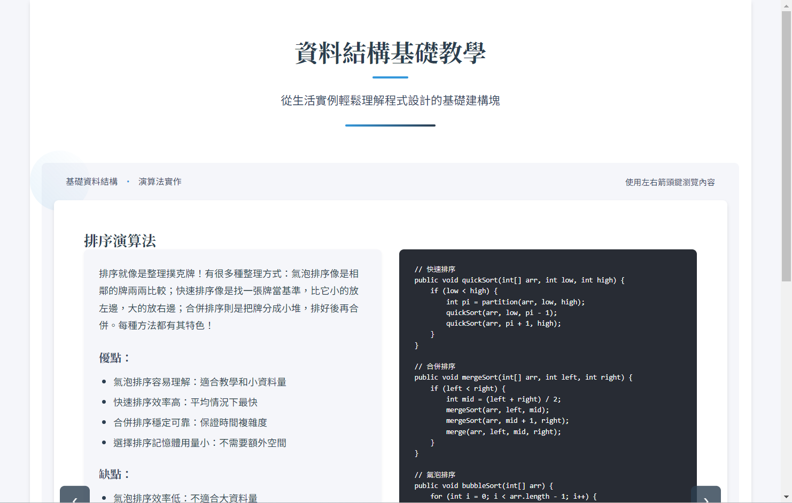
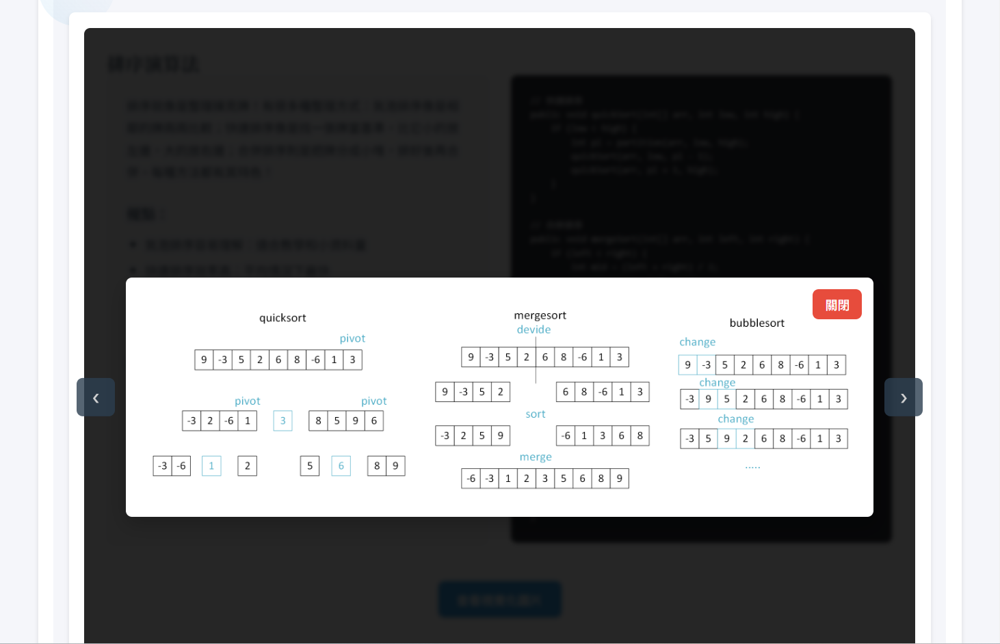

# 資料結構與演算法教學平台 🎓

本人因為熱愛資料結構，因此寫一個資料結構教學網站，證明對其之熱愛。一個資料結構與演算法學習平台，透過生活化的比喻和視覺化的展示，幫助初學者更容易理解程式設計的基礎概念。

## ✨ 特色

- 🎯 生活化的比喻解釋
- 📊 互動式視覺化展示
- 💻 實際程式碼範例
- 🔄 優缺點分析比較
- 📱 響應式設計

## 🗂 包含主題

### 基礎資料結構

- 陣列 (Array)
- 連結串列 (Linked List)
- 堆疊 (Stack)
- 佇列 (Queue)
- 樹 (Tree)

### 進階資料結構

- 圖 (Graph)
- 雜湊表 (Hash Table)

### 演算法

- 排序演算法
  - 氣泡排序
  - 快速排序
  - 合併排序
  - 堆積排序
- 圖演算法
  - 廣度優先搜尋 (BFS)
  - 深度優先搜尋 (DFS)

## 📄 License

本專案使用 [MIT License](LICENSE) 授權 - 詳見 [LICENSE](LICENSE) 檔案了解更多資訊。

Copyright (c) 2024 jos556
